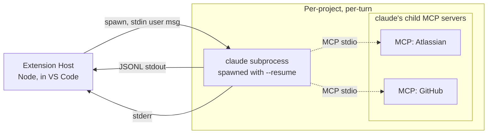

# Design: Agent Desktop

**Project:** Agent Desktop
**Created:** 2026-05-15
**Last Updated:** 2026-05-15

---

## Navigation

**Project Docs:** [README](README.md) | [SPEC](SPEC.md) | [DESIGN](DESIGN.md) *(you are here)* | [IMPLEMENTATION-GUIDE](IMPLEMENTATION-GUIDE.md) | [HANDOFF](HANDOFF.md)

**This Document:**
- [Design Philosophy](#design-philosophy)
- [Architecture Overview](#architecture-overview)
- [Key Design Decisions](#key-design-decisions)
- [Data Model](#data-model)
- [Design Evolution](#design-evolution)

---

## Design Philosophy

**1. Reuse, don't reimplement.**
The extension shells out to `claude` for every agent capability — model inference, tool use, MCP integrations, session resume, slash commands. Nothing in our code talks to an LLM API directly. If `claude` already does it, we drive it; we never wrap or reimplement it.

**2. Declarative spawn config; thin lifecycle.**
"How to spawn `claude`" is a single TypeScript constant. The lifecycle code that consumes it is small enough to read in one sitting. Following openclaw's pattern but with one fewer process layer — we spawn `claude` directly, not via an intermediate `acp` subcommand.

**3. Narrow v1, seamful by design.**
v1 ships the smallest set of moving parts that produces a finished technical document. Features the spike showed are reachable but not v1-critical — MCP inversion (extension as MCP server), tool-allowlist toggles, scaffold version pinning — are **explicit seams** in the architecture, not afterthoughts. Adding them later is plugging into a defined interface, not a rewrite.

---

## Architecture Overview

A single VS Code window hosts the extension. The extension manages N independent projects, each pairing a webview with a `claude` subprocess that runs in the project's workspace folder. The extension never opens a network connection to Anthropic; all model traffic flows through the `claude` CLI.

```
┌──────────────────────────────────────────────────────────────────────────┐
│ VS Code Window                                                           │
│                                                                          │
│  ┌─────────────┐  ┌──────────────────────────────────────────────────┐   │
│  │ Activity    │  │ Editor area                                      │   │
│  │ Bar         │  │                                                  │   │
│  │             │  │   ┌──────────────────────┐  ┌─────────────┐      │   │
│  │ Projects:   │  │   │ project-A: chat WV   │  │ SPEC.md     │      │   │
│  │  ◉ project-A│  │   │ (input + transcript) │  │ (editor)    │      │   │
│  │  ○ project-B│  │   └──────────────────────┘  └─────────────┘      │   │
│  │  ○ project-C│  │                                                  │   │
│  │             │  │   Multi-root file tree:                          │   │
│  │ [+] New     │  │     project-A/  project-B/  project-C/           │   │
│  │ [⤴] Open    │  └──────────────────────────────────────────────────┘   │
│  └─────────────┘                                                         │
│                                                                          │
│  Extension host (Node, in-process):                                      │
│    ProjectRegistry, ProjectStore (globalState),                          │
│    SessionManager (per-project), McpConfigSurface, WorkspaceManager      │
│                                                                          │
└─────┬────────────────────────────────────────────────────────────────────┘
      │ child_process.spawn(claude, ...)  — one per turn, per project
      ▼
   ┌─────────────┐  ┌─────────────┐  ┌─────────────┐
   │ claude (A)  │  │ claude (B)  │  │ claude (C)  │
   │ cwd=proj-A  │  │ cwd=proj-B  │  │ cwd=proj-C  │
   │ session=Sa  │  │ session=Sb  │  │ session=Sc  │
   └──────┬──────┘  └──────┬──────┘  └──────┬──────┘
          │ stdio: ["pipe","pipe","pipe"], JSONL on stdout
          │
          ▼ (claude's own MCP clients — opaque to the extension)
   ┌────────────────────────────────────────────────────────┐
   │ MCP servers configured per project (Atlassian, etc.)   │
   │  — entirely owned by claude, not by the extension      │
   └────────────────────────────────────────────────────────┘
```

**Per-turn process tree** (zoomed in on a single project mid-turn):



A "3-project user" has at most 3 `claude` subprocesses alive concurrently (one per project mid-turn). When a turn finishes, the `claude` process exits; the project goes idle until the next user message. MCP servers are children of `claude`, not of the extension — they live and die with the `claude` process.

### Component Descriptions

**ProjectRegistry** — In-memory map of open projects. Provides `listProjects()`, `getActive()`, `setActive()`, `add()`, `remove()`. Source-of-truth at runtime; backed by `ProjectStore` for persistence.

**ProjectStore** — Thin wrapper over VS Code `globalState`. Keys: `projects:<folderPath> = { sessionId, displayName, createdAt, lastResumeAt, modelHint? }`. Survives VS Code restarts.

**SessionManager** (per-project) — Owns one project's `claude` session lifecycle: stores `sessionId`, tracks token usage, decides when to dispatch `/compact`, exposes `prompt(text) → AsyncIterable<JsonlEvent>`. Spawns one `claude` subprocess per turn.

**ChatWebview** (per-project) — Webview panel showing the running transcript (markdown-rendered) and a prompt input. Receives streaming text from `SessionManager` via VS Code's `postMessage`.

**ProjectsView** — VS Code `TreeDataProvider` for the activity-bar sidebar. Renders the project list; click handlers call `ProjectRegistry.setActive()`.

**McpConfigSurface** — Reads/writes the per-project MCP config file (exact filename TBD — see Decision 9). Surfaces installed MCPs in a settings panel; lets the user add/remove.

**WorkspaceManager** — Generates and maintains `~/agent-desktop-projects/agent-desktop.code-workspace` listing every open project's folder as a workspace root. Re-saves on `ProjectRegistry` add/remove.

**JsonlParser** — A ~30-line stdout consumer (see Decision 5) that splits a `Readable` into a stream of typed `JsonlEvent` objects.

---

## Key Design Decisions

### Decision 1: Single-process topology (extension host → claude)

**Choice:** Extension host spawns `claude` directly as a child process. No intermediate process — no ACP layer, no openclaw-style helper subprocess.

**Alternatives considered:**
- **ACP middleware (like openclaw)** — rejected because we only ever spawn `claude`; the abstraction's value is provider-multiplexing across claude/codex/gemini, which we don't need.
- **One persistent claude process per project (long-lived)** — rejected because Spike 1 (HANDOFF Session 4) confirmed `-p` mode is one-shot; the live-session model is "many short-lived spawns, all using `--resume <id>`."

**Rationale:** Fewer moving parts. Lower latency. Easier debugging (one process to inspect per turn). Matches the runtime shape observed in spikes.

### Decision 2: Spawn argv (verbatim from spike, minus `--allowedTools`)

**Choice:**
```
claude -p --output-format stream-json --include-partial-messages --verbose \
       --setting-sources user \
       --session-id <uuid>             # fresh spawn
       --resume <uuid>                 # continuing existing session
```

**Alternatives considered:**
- **Add `--allowedTools <whitelist>`** — deferred to a settings toggle (Decision 14). v1 default is "no allowlist; claude has its full built-in tool surface."
- **`--max-turns 1`** — unnecessary; `-p` already implies single-turn-per-invocation.

**Rationale:** Spike 1 confirmed this argv produces a clean JSONL stream with usage metadata and zero stderr noise. Spike 2a confirmed `--resume` preserves session-id with 4-5× cost reduction.

### Decision 3: Stdio shape `["pipe", "pipe", "pipe"]`

**Choice:** All three stdio streams are pipes captured by the extension host.

**Alternatives considered:**
- **openclaw's `["pipe", "pipe", "inherit"]`** — rejected because in VS Code there's no "parent terminal" to inherit into; claude's stderr would leak into the integrated terminal or vanish.

**Rationale:** Capture stderr into a dedicated `vscode.OutputChannel` ("Agent Desktop: claude (<project>)") so failures surface in a structured place the user can read.

### Decision 4: One claude process per turn (not per session)

**Choice:** Each user message spawns a fresh `claude` subprocess with `--resume <sessionId>`. The subprocess exits when the turn completes (`result` event). No long-running per-session process.

**Alternatives considered:**
- **Long-running per-session process** — rejected per Spike 1 (`-p` mode is single-turn).
- **Pool of pre-warmed processes** — rejected as premature optimization; cache_read makes resumes cheap (~$0.006 per turn observed).

**Rationale:** Matches `claude`'s actual lifecycle. "Turn in flight" is well-defined by whether the child process is alive — natural state machine.

### Decision 5: NDJSON parser — owned, not vendored

**Choice:** Ship a ~30-line line-splitter in `src/jsonl.ts`. Drop the `@agentclientprotocol/sdk` dependency that openclaw uses.

**Alternatives considered:**
- **Use `@agentclientprotocol/sdk`'s `ndJsonStream`** — rejected because ACP is not used and the dep brings a larger surface than we need.
- **Pull `ndjson` from npm** — fine, but a 30-line splitter is faster to audit and has zero supply-chain footprint.

**Rationale:** The parser is trivial (split on `\n`, `JSON.parse` each non-empty line, hold a partial-line buffer for split-mid-line cases). Owning it removes a dependency and a transitive risk for ~30 LOC.

### Decision 6: Session-id storage schema

**Choice:** Stored in VS Code `globalState`, keyed by project folder absolute path.

```ts
type ProjectStoreEntry = {
  sessionId: string;            // uuid v4, generated by extension on New Project
  displayName: string;          // user-chosen name
  createdAt: string;            // ISO 8601
  lastResumeAt: string | null;  // null until first successful resume
  modelHint?: string;           // optional per-project model override
};
```

**Alternatives considered:**
- **JSON file in `~/.agent-desktop/projects.json`** — rejected. Not portable across machines anyway (claude session transcripts live on the local install); `globalState` is the VS Code-native answer.
- **`SecretStorage`** — overkill; nothing in this entry is sensitive.

**Rationale:** Native, survives restarts, inspectable via VS Code's command palette ("Open Extension Storage"). Resolves SPEC Open Question #4.

### Decision 7: Codeatlas seeding — bundled snapshot, documented upstream commit

**Choice:** Ship the `codeatlas` scaffold's `template/` subdirectory verbatim as an extension resource at `extension/resources/scaffolds/codeatlas/`. "New Project" copies that directory into the new project folder. The README documents the upstream commit hash; refresh on extension release. The `scaffolds/` parent leaves room to bundle additional scaffolds later (e.g., a spec-driven new-project scaffold mirroring our local `template/`).

Inspection on 2026-05-15 (HANDOFF Session 7) confirmed the scaffold lives at `template/` in the upstream repo — the repo root contains only `README.md`, `LICENSE`, and `template/`. The bundled directory layout will mirror `template/` 1:1.

**Alternatives considered:**
- **`git clone` on every New Project** — rejected: network dependency, slower, version drift not tracked.
- **Always-latest fetch from `github.com/ngyihsin/codeatlas`** — rejected for the same reasons + supply-chain risk.

**Rationale:** Offline-capable, deterministic, reviewable on each extension update. Resolves SPEC Open Question #5.

### Decision 8: `claude` not on PATH — activation check + install guidance

**Choice:** On extension activation, run `claude --version` once. If the binary isn't found (or returns non-zero), show a notification with a "Get Claude Code" button linking to the official install page; **gate** the "New Project" and "Open Project" commands until the check succeeds.

**Rationale:** SPEC didn't list this failure mode. Without the check, the user creates a project and sees a confusing spawn error on the first prompt. Better to fail fast with actionable guidance.

### Decision 9: MCP config filename — `.mcp.json` at project root [RESOLVED]

**Choice:** Per-project MCP servers are configured in **`.mcp.json` at the project root** (verified 2026-05-15 against `claude` v2.1.142 — see HANDOFF Session 6). Three independent signals in `claude --help` and `claude mcp --help` confirm: (1) `claude doctor` documents *"stdio servers from .mcp.json are spawned for health checks"*; (2) `claude mcp reset-project-choices` references *"project-scoped (.mcp.json) servers"*; (3) the `--mcp-config <file>` flag accepts inline MCP config JSON for per-invocation servers.

**Implementation options for `McpConfigSurface`:**
- **(a) Read/write `.mcp.json` directly** — fastest, full control; extension mirrors claude's expected JSON shape.
- **(b) Shell out to `claude mcp {list,get,add,add-json,remove}`** — slower (subprocess per op), but claude validates input and we inherit format changes for free.
- **Recommendation: (b) for v1**, falling back to (a) if `claude mcp` JSON output proves insufficient.

**Related flags reserved for design:**
- `--mcp-config <file>` — pass an inline MCP config to a single spawn. Useful for the future MCP-inversion seam (Decision 13).
- `--strict-mcp-config` — restricts the spawn to only the servers listed in `--mcp-config`, ignoring `.mcp.json`. Useful when wiring the extension's own MCP server (future "VS Code-aware tools") without polluting the user's project file.

**Rationale:** Resolves SPEC Requirement #7's `.claude/settings.json` placeholder. `McpConfigSurface` now has a verified target file and a CLI surface to drive it.

### Decision 10: Auto-`/compact` mechanics

**Choice:** Driven from the JSONL stream. After each `result` event, compute:
```
effective_context = input_tokens + cache_creation_input_tokens + cache_read_input_tokens
context_ratio = effective_context / context_window  // from result.modelUsage[dominantModel].contextWindow
```
If `context_ratio > 0.75`, dispatch a **separate** `claude -p --resume <sessionId>` invocation with stdin = `/compact`. Wait for `system.compact_boundary` in the JSONL stream to confirm. Surface a toast: *"Context compacted (was 76% → now <new>%)."*

**Alternatives considered:**
- **Continuous compaction (every turn at 60%)** — rejected: noisy, wasteful.
- **Out-of-band summary + fresh resume (Plan B from SPEC Q1)** — rejected: Spike 2b confirmed Plan A works (`/compact` is injectable in `-p` mode, emits `system.compact_boundary`, `num_turns: 0`).

**Rationale:** Single trigger condition, well-defined event for confirmation, observable cost (~$0.022 per compaction in our spike).

### Decision 11: .md edit handling — auto-apply via claude's Edit tool

**Choice:** Claude's built-in Edit/Write tools write directly to disk in the project's workspace folder. Extension does nothing special; VS Code's native file-watcher and "file changed externally — reload?" prompt cover the user-edit-collision case.

**Alternatives considered:**
- **Diff-then-accept (intercept Edit calls, show diff, user confirms)** — deferred to a future "review mode." Hooks are reserved via Decision 13 (MCP-inversion seam).

**Rationale:** Already locked in SPEC after the Phase 1 walkthrough. Reusing claude's built-in Edit semantics inherits its safety properties (exact-string-replace, not regex).

### Decision 12: Project-folder-deleted-while-live handling

**Choice:** Per active project, run a `vscode.workspace.createFileSystemWatcher` on the project root. On a delete event matching the root, kill the `claude` child if alive, remove the project from `ProjectRegistry`, regenerate the multi-root workspace, and surface a toast: *"Project '<name>' was removed — its claude session has been closed."*

**Rationale:** Without this, the sidebar shows a ghost project pointing at nothing. Cheap to add; expensive to debug if missed.

### Decision 13: MCP inversion — seam reserved, not built

**Choice:** Define an `AgentDesktopMcpServer` interface in `src/mcp/types.ts` and a stub implementation that registers an **empty** MCP server when constructing claude's spawn config (using the same `bundleMcp`-style pattern openclaw uses). v1 ships with zero tools registered; the interface is present so future VS Code-aware tools (`agentdesktop__open_file_at`, `agentdesktop__show_diff`, `agentdesktop__list_projects`, `agentdesktop__current_selection`, etc.) can be plugged in without touching spawn or lifecycle code.

**Alternatives considered:**
- **Build at least one tool now to validate the seam** — tempting but deferred unless DESIGN review surfaces a v1-required use case.
- **Skip the seam entirely until needed** — rejected: retrofitting MCP inversion later means changing the spawn config and potentially the per-project state shape (whether a Claude config file is written per spawn).

**Rationale:** Cost of the seam now is ~50 lines of unused-but-named code. Cost of adding it later is potentially much higher (breaking the spawn contract).

### Decision 14: Tool-allowlist policy — settings-level toggle reserved

**Choice:** Expose a VS Code setting `agentDesktop.tools.allowlist` (string array, default `[]` = no restriction). When non-empty, the spawn config injects `--allowedTools <comma-join>`. UI for this is deferred to a settings panel; v1 users can edit `settings.json` directly.

**Rationale:** Resolves SPEC Open Question #9. v1 default is "all tools" (single-user developer tool); cautious users opt in to a tighter allowlist via setting.

### Decision 15: Latency budget (independently testable)

**Choice:**
- **First token visible in webview:** ≤ 1 s from user submit.
- **Subsequent text chunks rendered:** ≤ 50 ms from receipt in the webview's `message` event.
- **Project switch (sidebar click → webview foregrounded with prior transcript):** ≤ 500 ms.

**Rationale:** "Sub-second streaming" in SPEC is fuzzy. These three are independently measurable in a manual test pass and will land in `TESTING-GUIDE.md`.

---

## Data Model

### JSONL event union (claude → extension)

One JSON object per line on stdout. Discriminator: top-level `type` (plus `subtype` for `system` and `result`). All event shapes are observed in Spike 1 and 2 outputs at `/tmp/agent-desktop-spikes/`.

```ts
type JsonlEvent =
  | SystemInit
  | SystemStatus
  | SystemCompactBoundary
  | RateLimitEvent
  | StreamEvent
  | AssistantEvent
  | UserEvent
  | ResultEvent;

type SystemInit = {
  type: "system";
  subtype: "init";
  session_id: string;
  cwd: string;
  tools: string[];
  slash_commands: string[];        // includes "compact"
  model: string;                   // e.g., "claude-sonnet-4-6"
  permissionMode: string;
  claude_code_version: string;
  memory_paths: { auto: string };
  mcp_servers: unknown[];
  uuid: string;
};

type SystemStatus = {
  type: "system";
  subtype: "status";
  status: string | null;           // e.g., "requesting"
  permissionMode?: string;
  uuid: string;
  session_id: string;
};

type SystemCompactBoundary = {
  type: "system";
  subtype: "compact_boundary";
  uuid: string;
  session_id: string;
  // full payload may include compact_metadata; unverified in v1 spike
};

type RateLimitEvent = {
  type: "rate_limit_event";
  rate_limit_info: {
    status: "allowed" | "rate_limited";
    resetsAt: number;              // unix seconds
    rateLimitType: string;         // e.g., "five_hour"
    overageStatus: string;
  };
  uuid: string;
  session_id: string;
};

type StreamEvent = {
  type: "stream_event";
  event: AnthropicSdkMessageEvent;
  session_id: string;
  parent_tool_use_id: string | null;
  uuid: string;
  ttft_ms?: number;
};

type AnthropicSdkMessageEvent =
  | { type: "message_start"; message: { id: string; model: string; role: "assistant"; usage: Usage } }
  | { type: "content_block_start"; index: number; content_block: { type: "text"; text: "" } }
  | { type: "content_block_delta"; index: number; delta: { type: "text_delta"; text: string } }
  | { type: "content_block_stop"; index: number }
  | { type: "message_delta"; delta: { stop_reason: string }; usage: Usage; context_management: { applied_edits: unknown[] } }
  | { type: "message_stop" };

type AssistantEvent = {
  type: "assistant";
  message: { id: string; role: "assistant"; content: Array<{ type: "text"; text: string }>; usage: Usage };
  session_id: string;
  parent_tool_use_id: string | null;
  uuid: string;
  request_id?: string;
};

type UserEvent = {
  type: "user";
  // observed during /compact turns; exact structure TBD when first non-compact user event lands
};

type ResultEvent = {
  type: "result";
  subtype: "success" | "error";
  is_error: boolean;
  result: string;                  // assistant's final text
  num_turns: number;               // 0 for /compact
  duration_ms: number;
  duration_api_ms?: number;
  ttft_ms?: number;
  session_id: string;
  total_cost_usd: number;
  usage: Usage;
  modelUsage: Record<string, ModelUsage>;
  permission_denials: unknown[];
  terminal_reason: "completed" | "interrupted" | "error";
  uuid: string;
};

type Usage = {
  input_tokens: number;
  output_tokens: number;
  cache_creation_input_tokens: number;
  cache_read_input_tokens: number;
  cache_creation: {
    ephemeral_5m_input_tokens: number;
    ephemeral_1h_input_tokens: number;
  };
  service_tier: string;
};

type ModelUsage = {
  inputTokens: number;
  outputTokens: number;
  cacheReadInputTokens: number;
  cacheCreationInputTokens: number;
  webSearchRequests: number;
  costUSD: number;
  contextWindow: number;           // e.g., 400_000 for Sonnet 4.6, 200_000 for Haiku 4.5
  maxOutputTokens: number;
};
```

**Events the extension actively consumes:**
- `stream_event.content_block_delta.delta.text_delta.text` → append to webview transcript (streaming render)
- `stream_event.message_delta.usage` + `result.modelUsage[*].contextWindow` → compute `effective_context / contextWindow`
- `system.compact_boundary` → clear pending-compaction flag; toast
- `result` → mark turn complete; record cost; trigger compaction check
- All others → log to `OutputChannel` only (for debugging)

### Webview ↔ extension-host message protocol

Bidirectional JSON via `vscode.WebviewView.webview.postMessage`. Discriminator: `kind`.

```ts
// extension → webview
type ToWebview =
  | { kind: "turn_started"; turnId: string }
  | { kind: "text_delta"; turnId: string; text: string }
  | { kind: "turn_complete"; turnId: string; cost_usd: number; context_pct: number }
  | { kind: "compact_started" }
  | { kind: "compact_done"; new_context_pct: number }
  | { kind: "transcript_replay"; messages: TranscriptMessage[] }
  | { kind: "error"; message: string };

// webview → extension
type FromWebview =
  | { kind: "submit_prompt"; text: string }
  | { kind: "interrupt" }              // ctrl-c — kill claude child for this turn
  | { kind: "request_transcript" };    // on first render after activation
```

### Per-project runtime state

```ts
type ProjectRuntime = {
  store: ProjectStoreEntry;            // persisted; see Decision 6
  folderPath: string;
  webview?: vscode.WebviewView;        // present when the project's view is rendered
  activeTurn?: {
    turnId: string;
    child: ChildProcess;
    startedAt: number;
    transcriptBuffer: string;          // accumulated text_delta for the current assistant message
  };
  contextPctMostRecent: number;        // 0..1, updated after each result event
  pendingCompaction?: { startedAt: number };
  transcript: TranscriptMessage[];     // in-memory; persisted lazily
  outputChannel: vscode.OutputChannel; // dedicated for this project's stderr + JSONL log
};

type TranscriptMessage =
  | { role: "user"; text: string; timestamp: string }
  | { role: "assistant"; text: string; turnId: string; cost_usd: number; timestamp: string };
```

Transcript is persisted to `<projectFolder>/.agent-desktop/transcript.json` on every `turn_complete`, so the webview can rehydrate when the project is reopened or VS Code is restarted.

---

## Design Evolution

Track how the design changes over time as we learn more.

### 2026-05-15 — Initial design

- Drafted from approved SPEC (v2 post-pivot) + Session 3 external review (11 design-level recommendations) + Session 4 spike findings.
- **15 design decisions** captured covering: topology (Decision 1), argv (D2), stdio shape (D3), per-turn lifecycle (D4), parser ownership (D5), session-id schema (D6), codeatlas seeding (D7), activation-time `claude --version` check (D8), MCP config filename verification (D9), auto-`/compact` mechanics (D10), .md edit handling (D11), folder-delete handling (D12), MCP-inversion seam (D13), tool-allowlist toggle (D14), latency budget (D15).
- **SPEC open questions resolved by design decisions:**
  - Q4 (project-list storage) → Decision 6 (`globalState`)
  - Q5 (scaffold versioning) → Decision 7 (bundled snapshot)
  - Q9 (tool-allowlist policy) → Decision 14 (deferred setting)
- **SPEC open questions still open at design time** (to be addressed in IMPLEMENTATION-GUIDE):
  - Q3 (MCP config UX surface)
  - Q6 (resume failure mode)
  - Q7 (webview chat ergonomics — markdown rendering, syntax highlighting, image paste)
  - Q8 (MCP discovery / onboarding)
- **Action item before IMPLEMENTATION-GUIDE:** confirm Decision 9 (MCP config filename) by inspecting a running `claude` install.

### 2026-05-15 — Decision 9 resolved + bonus `claude` flag discoveries

- **Decision 9 resolved.** MCP config file is `.mcp.json` at project root (see Decision 9 above for the resolved entry). SPEC Requirement #7 corrected. McpConfigSurface will shell out to `claude mcp` subcommands as the v1 implementation path.
- **Additional `claude` CLI flags worth designing around** (discovered while verifying Decision 9):
  - **`--add-dir <dirs>`** — extends tool-access scope beyond cwd. Useful when a project references source code in a sibling directory. Reserve as a Decision-2 follow-up if the user need surfaces.
  - **`--max-budget-usd <amount>`** — hard cost cap per `--print` invocation. Pair with Decision 10's auto-compact for runaway-cost protection; worth exposing as a setting (`agentDesktop.budget.perTurnUsd`).
  - **`--disallowedTools`** and **`--tools`** — additive ways to restrict claude's built-in tool surface. Decision 14's setting should accept either allowlist or disallowlist semantics; design the setting shape to cover both.
  - **`--input-format stream-json`** — claude accepts streaming JSON input under `-p`. **Possible future optimization:** one long-lived claude process per session (multi-turn) using stream-json input/output, instead of one-process-per-turn (Decision 4). Defer to a v2 spike; v1 keeps the simpler model.
  - **`--include-hook-events`** — adds hook lifecycle events to the JSONL stream. Useful for debugging MCP / tool failures during development. Off by default in v1.
  - **`--fork-session`** — creates a new session ID when resuming. Could be exposed as a "Branch this session" command in v2 (e.g., to spawn a sibling project from a paused conversation).
  - **`--no-session-persistence`** — disables transcript persistence on disk. We rely on persistence for Decision 6 (resume); never set this flag in v1.
- No other design decisions affected; data model unchanged.

---

**Last Updated:** 2026-05-15
